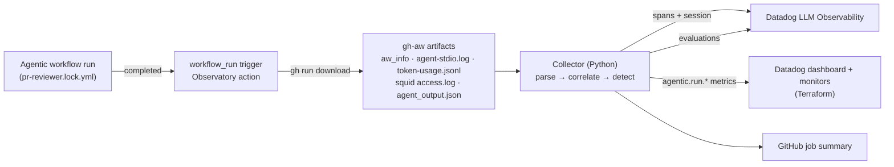

# Agentic Workflow Observatory

**Datadog LLM Observability for [GitHub Agentic Workflows](https://github.com/github/gh-aw).**
Every agentic workflow run becomes a Datadog trace that knows which repository, pull request, commit and
Markdown workflow it came from. Runs that pass CI but still failed as agents get flagged.


---

## Prerequesites

- a Datadog account with LLM Observability enabled
- a repository already running GitHub Agentic Workflows

## The problem

A GitHub agentic workflow run does not fail the way a unit test does. A run can finish with a green check and still:

- post a **useless PR comment** ("LGTM. TODO: check tests."),
- **loop**, calling the same tool with the same arguments five times when one call would do,
- have its egress **blocked by the AWF firewall**, so `npm install` fails and the agent works around it without saying so,
- run out of its **AI Credits budget** (`max-ai-credits`) or `max-turns` partway through its reasoning.

Datadog LLM Observability does capture reasoning, tool calls and cost, but it knows nothing about GitHub.
It cannot tell that a trace belongs to *run 9876543210 of `pr-reviewer.md` on PR #42*.
This project connects the two.

## What it does



After each agentic run finishes, a small companion workflow downloads the run's artifacts. gh-aw already uploads
them, so **your agentic workflows need no changes**. The collector then:

1. **Correlates.** It reads the `workflow_run` event to get the repository, PR, SHA, CI conclusion and the compiled lock file. From the lock file it finds the Markdown source (`foo.lock.yml` → `foo.md`).
2. **Rebuilds the trace.** It turns the artifacts into one LLM Observability trace per run:
   - an `agent` root span (input: the workflow's Markdown instructions; output: what the agent posted),
   - an `llm` child span per model call (tokens, AI Credits),
   - a `tool` child span per tool call (errors marked),
   - a firewall span and one span per safe output.

   Every run on the same PR shares one **session** (`owner/repo#pr-42`), so you can replay an agent's history on a PR.
3. **Detects silent failures** with deterministic detectors (see below).
4. **Ships** spans, evaluations and low-cardinality metrics to Datadog over its public HTTP intake APIs. No Datadog Agent is needed on the runner.

Each run gets one of four verdicts:

| Verdict | Meaning |
|---|---|
| `healthy` | CI green, no findings |
| `degraded` | CI green, warnings only |
| `silent_failure` | **CI green, but the agent failed.** This is the case nothing else catches. |
| `failed` | CI red (already visible in GitHub) |

## Quick start 

**1. Add the Datadog API key** as a repository or organization secret named `DD_API_KEY`.

**2. Drop in one workflow.** Copy [`examples/workflows/agentic-observatory.yml`](examples/workflows/agentic-observatory.yml)
to `.github/workflows/` in your repo and list the agentic workflows to observe:

```yaml
on:
  workflow_run:
    workflows: ["PR Reviewer", "Issue Triage"] # List here
    types: [completed]
permissions:
  actions: read
  contents: read
jobs:
  observe:
    runs-on: ubuntu-latest
    steps:
      - uses: actions/checkout@v4
        with: { sparse-checkout: .github/workflows }
      - uses: victorperr/agentic-workflow-observatory@v1
        with:
          datadog-api-key: ${{ secrets.DD_API_KEY }}
```

**3. (Optional) Deploy the dashboard and monitors** once per Datadog org:

```bash
cd terraform
cp terraform.tfvars.example terraform.tfvars   # add API + app keys, notification handles
terraform init && terraform apply
```

This creates a dashboard (runs by verdict, AI Credits by workflow, findings, budget utilization, tool calls)
and four monitors: silent failures, firewall blocks, budget pressure, and tool loops.

### Action inputs

| Input | Default | |
|---|---|---|
| `datadog-api-key` | *(required)* | |
| `datadog-site` | `datadoghq.com` | `datadoghq.eu`, `us3.datadoghq.com`, `us5.datadoghq.com`, `ap1.datadoghq.com` |
| `ml-app` | `github-agentic-workflows` | LLM Observability application name |
| `budget-aic` | `1000` | Set to the workflow's `max-ai-credits` |
| `loop-threshold` | `3` | Identical tool calls before `tool_loop` fires |
| `max-tool-calls` | `40` | |
| `fail-on` | `never` | `silent_failure` or `degraded` makes the observer job fail, so the problem shows up in the checks UI |
| `dry-run` | `false` | Print the payloads instead of sending them |

Outputs: `verdict`, `trace-id`.

If needed, every input in the "Action inputs" table goes in the with: block of that step.
```yaml
      - uses: victorperr/agentic-workflow-observatory@v1
        with:
          datadog-api-key: ${{ secrets.DD_API_KEY }}   # required
          datadog-site: datadoghq.eu
          ml-app: github-agentic-workflows
          budget-aic: "300"
          loop-threshold: "3"
          ...
```


## Detectors

| Code | Severity | Signal | Source artifact |
|---|---|---|---|
| `tool_loop` | error | Same tool + same arguments ≥ N times | `agent-stdio.log` / MCP gateway logs |
| `excessive_tool_calls` | warning | More tool calls than the threshold | same |
| `tool_errors` | warning | At least 1/3 of tool calls returned errors | `tool_result.is_error` |
| `firewall_blocked` | error | Egress denied by the AWF firewall (names the domains to add to `network.allowed`) | Squid `access.log` |
| `budget_exhausted` / `budget_near_limit` | error / warning | AI Credits ≥ 100% / ≥ 80% of budget, or the proxy stopped the agent | `token-usage.jsonl`, stdio |
| `max_turns_reached`, `agent_timeout` | error | Agent was cut off | `agent-stdio.log` |
| `no_output` | error | Green run with no safe output and no explicit `noop` | `agent_output.json` |
| `safe_output_invalid` | error | Safe output rejected by validation | `agent_output.json` |
| `low_quality_output` | warning | Too short, unrendered `${{ }}`, TODO/placeholder, "as an AI model", repeated paragraphs, agent admitting it could not do the task | safe output body |
| `missing_tool`, `missing_data`, `gave_up` | warning | Agent reported it lacked a tool or data | safe outputs |
| `threat_detected` | error | gh-aw threat detection flagged the run | `detection_result.json` |

Detector results are also sent as **LLM Observability evaluations** attached to the root span
(`aw_verdict`, `aw_tool_efficiency`, `aw_firewall_clean`, `aw_budget_utilization`, `aw_output_quality`).
You can filter and chart them next to the traces, and they can feed Datadog's annotation queues and experiments.

### Semantic quality: use Datadog's managed evaluations

You can enable a managed or custom LLM-as-judge evaluation on the `github-agentic-workflows` ml_app in LLM Observability.
It will grade every run with no extra API key or code here.

## What you see in Datadog

- **LLM Observability → Traces**: filter by `gh.repo:acme/webapp`, `gh.pr:42`, `aw.verdict:silent_failure` or `aw.finding:firewall_blocked`. The root span's metadata links back to the GitHub run.
- **Sessions**: every agent run on a PR, in order.
- **Metrics** (`agentic.run.*`): `count`, `silent_failure`, `aic`, `budget_utilization`, `tokens.{input,output,cache_read}`, `tool_calls`, `firewall.blocked_requests`, `duration_seconds`, `finding{finding:<code>}`.
  Metric tags are deliberately low-cardinality (`repo`, `workflow`, `engine`, `model`, `verdict`). Run IDs and PR numbers are only on traces, so custom-metric costs stay bounded.
- **GitHub job summary**: a verdict, a usage table, the findings, and a deep link to the trace.

## Try it locally

No Datadog account is needed for a dry run. The repo ships two sample runs in [`tests/fixtures/runs`](tests/fixtures/runs):

```bash
python -m pip install -e ".[dev]"
aw-observatory collect \
  --run-dir tests/fixtures/runs/silent-failure \
  --event tests/fixtures/runs/silent-failure/event.json \
  --repo-root tests/fixtures/repo \
  --budget-aic 100 --dry-run --summary summary.md
```

That run exits green in CI, but the collector reports:
- `tool_loop` (the diff tool was called 4 times with identical arguments),
- `tool_errors`,
- `firewall_blocked` on `registry.npmjs.org`,
- `budget_near_limit` (88.5 of 100 AIC),
- `low_quality_output` (a 32-character "LGTM … TODO" comment).

Verdict: **silent_failure**.

To backfill real runs, download them with `gh run download <run-id> -D run/` (or `gh aw logs`), then run
`aw-observatory collect --run-dir run/ --repo owner/name` with `DD_API_KEY` set.

## Repository layout

```
action.yml                      Composite GitHub Action (what customers install)
src/aw_observatory/
  context.py                    workflow_run event → RunContext (repo, PR, SHA, .md source)
  artifacts.py                  gh-aw artifacts → RunTelemetry (tolerant to layout changes)
  detectors.py                  silent-failure detectors and verdict
  datadog.py                    LLM Obs spans / evaluations / metrics payloads + HTTP client
  pricing.py                    AIC estimate when the proxy did not report it
  report.py, cli.py             JSON record, job summary, CLI
schemas/agentic-event.schema.json   normalized run record (`--output`)
terraform/                      Datadog dashboard + monitors
examples/workflows/             drop-in observer workflow + sample gh-aw workflow
tests/                          pytest suite with realistic run fixtures
```


## Limitations

- gh-aw's token log does not include prompt or completion text, so `llm` spans carry token counts and cost but no messages.
- When artifacts have no per-call timestamps, child spans are laid out evenly across the run window.
- When the API proxy does not report AI Credits, cost is estimated from list prices in [`pricing.py`](src/aw_observatory/pricing.py) and marked with `*` in the summary.
- The `workflow_run` event only lists PRs from the same repository, so runs triggered from forks are grouped by branch instead of by PR.

## Development

See [CONTRIBUTING.md](CONTRIBUTING.md).

```bash
python -m pip install -e ".[dev]"
python -m pytest
```

## License

[MIT](LICENSE)
